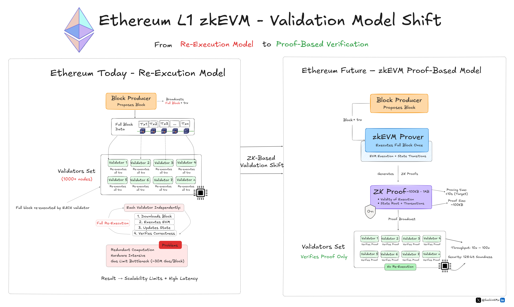

# 📊 Technical Diagrams & Visual Explanations

Original system architecture diagrams and protocol workflows created to explain complex Web3 infrastructure.

---

## 🔐 Fully Homomorphic Encryption – Compute Flow

**Focus:** How encrypted inputs are processed in an untrusted compute environment using FHE.

---

## 🕵️ Inco Confidential Execution Layer – Architecture

**Focus:** Confidential compute layer design using TEE, FHE, MPC and on-chain attestations.

---

## ⚡ zkEVM Validation Shift – Re-Execution vs Proof Model

**Focus:** How Ethereum moves from validator re-execution to ZK proof-based verification.

---
